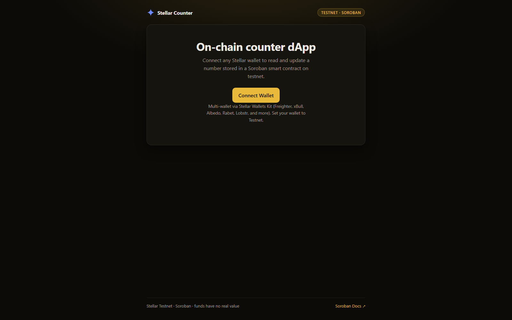

# Stellar Counter (Soroban)

A Stellar **Soroban smart-contract dApp**: connect any Stellar wallet, then **read and write an on-chain counter** stored in a Soroban contract on testnet, watch the **contract events** it emits, and follow each transaction through **pending, success, or failure**.

Built for the Rise In *Stellar Journey to Mastery* — Level 2 (Yellow Belt) challenge.

> ⚠️ **Testnet only.** This app talks to the Stellar **test network**. Testnet XLM has **no real value**.

## Features

- 🔌 **Multi-wallet connect** via [Stellar Wallets Kit](https://github.com/Creit-Tech/Stellar-Wallets-Kit) (Freighter, xBull, Albedo, Rabet, Lobstr, Hana, and more).
- 🌐 **Network guard**: reads the wallet's network and requires **Testnet**.
- 📖 **Read contract state**: the counter value is read by **simulation** (no fee, no signature).
- ✍️ **Write to the contract**: `increment(by)` and `reset()` are real on-chain invocations (prepare → sign in wallet → submit).
- 🔔 **Contract events**: lists recent `inc` / `reset` events emitted by the contract.
- ⏳ **Transaction status tracking**: every write shows building → signing → submitting → confirming, then success (with tx hash + explorer link) or a decoded failure.
- 🚰 **Friendbot**: funds a brand-new testnet account in one click.

## Deployed contract (testnet)

| | |
| --- | --- |
| Contract ID | [`CBVQQHNB…56S6QC24`](https://stellar.expert/explorer/testnet/contract/CBVQQHNBJU3DAUUDL65VN7CGKYEETPMHW2HANPZJVGHYQMML56S6QC24) |
| Source | [`contracts/yellow-counter/`](contracts/yellow-counter/) |
| SDK | `soroban-sdk` 26 (built to `wasm32v1-none`) |
| Verified call | [`3d8cf4c5…6edcb4c`](https://stellar.expert/explorer/testnet/tx/3d8cf4c589806566a47a6660e48430288296a413aa8cfab915350d93b6edcb4c): `increment(5)` returned `5` and emitted an `inc` event |

## Tech stack

| Layer | Choice |
| --- | --- |
| Contract | Rust + Soroban (`soroban-sdk`), deployed via `stellar-cli` |
| Frontend | React 19 + Vite + TypeScript |
| Wallets | `@creit.tech/stellar-wallets-kit` v2 |
| Chain | `@stellar/stellar-sdk` (Soroban RPC, testnet) |

## Quick start

**Prerequisites:** Node 18+ and a Stellar wallet extension (e.g. [Freighter](https://www.freighter.app/)) set to **Testnet**.

```bash
npm install
npm run dev      # http://localhost:5173
```

1. Click **Connect Wallet** and pick your wallet.
2. If the account is new, click **Fund with Friendbot**.
3. Enter an amount and click **Increment** (or **Reset**), then approve in your wallet.
4. The counter updates and the transaction appears under **Recent events** with a Stellar Expert link.

Production build:

```bash
npm run build && npm run preview
```

## The smart contract

[`contracts/yellow-counter/src/lib.rs`](contracts/yellow-counter/src/lib.rs) is a small counter in instance storage:

- `increment(by: u32) -> u32` — reads, adds, writes back, **emits an `inc` event**, bumps the instance TTL.
- `get() -> u32` — reads the current value.
- `reset()` — zeroes the counter and emits a `reset` event.

Build + deploy it yourself (WSL/Linux, `stellar-cli` 26+):

```bash
cd contracts/yellow-counter
rustup target add wasm32v1-none
stellar contract build
stellar keys generate me --network testnet --fund
stellar contract deploy \
  --wasm target/wasm32v1-none/release/yellow_counter.wasm \
  --source-account me --network testnet
```

Or use the portable helper scripts from the repo root:

```bash
bash scripts/wsl-deploy-counter.sh
bash scripts/wsl-invoke-counter.sh
```

## Security model

This is a **demo on testnet**. The counter is intentionally **permissionless**: `increment` and `reset` do not call `require_auth`, so any account can change or zero the shared value. That is by design for a public shared counter. A production version would gate `reset` (and likely `increment`) behind `require_auth` and an owner/admin check. The release profile sets `overflow-checks = true`, so a `u32` overflow traps instead of wrapping.

## How it works

- [`src/lib/wallet.ts`](src/lib/wallet.ts) — multi-wallet connect/sign/disconnect via Stellar Wallets Kit.
- [`src/lib/contract.ts`](src/lib/contract.ts) — Soroban: read via `simulateTransaction`, write via `prepareTransaction` → wallet sign → `sendTransaction` → poll `getTransaction`, and `getEvents` for the event feed.
- [`src/App.tsx`](src/App.tsx) — UI and state.

The private key never leaves the wallet: the app builds an unsigned invocation, the wallet signs it, and the app submits the signed transaction to the Soroban RPC.

## Screenshots



> For the connected / counter / events views, run the app per Quick Start and connect a wallet on Testnet.

## Submission checklist

See [`SUBMISSION.md`](SUBMISSION.md) for the reviewer-facing summary, contract ID, on-chain proof, and run commands.

## License

MIT
